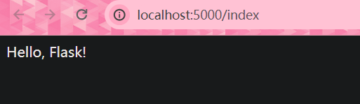
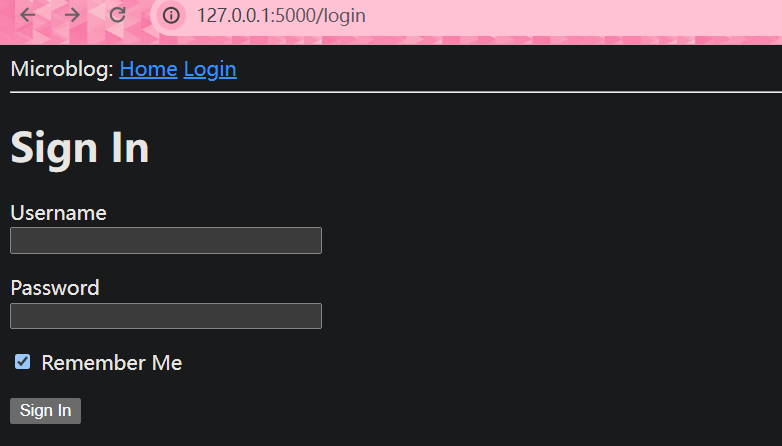
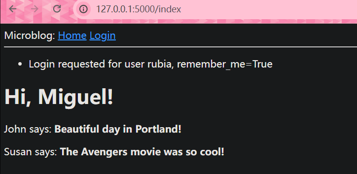
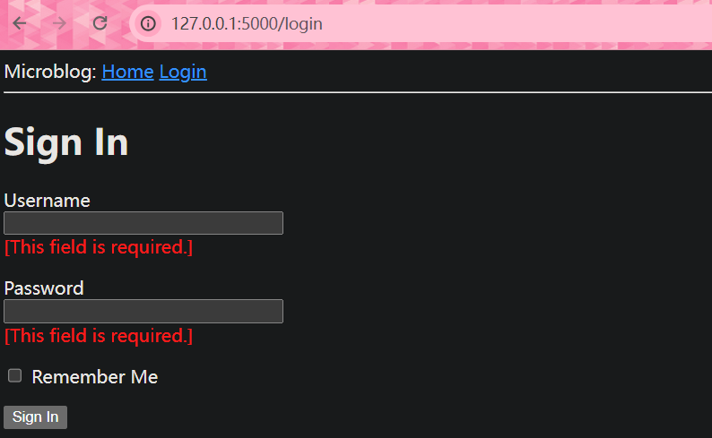

# 第一章 Hello，Flask！

## 创建项目

```bash
$ mkdir microblog
$ cd microblog
```

> 创建虚拟环境并激活

```bash
$ python -m venv venv
$ venv/Scripts/activate
```

> 安装Flask

```bash
$ pip install flask
```

## “Hello, Flask”应用

```py
# 创建app/__init__.py
from flask import Flask

app = Flask(__name__)

from app import routes
```

```python
# 创建app/routes.py
# 第二个app是__init__.py中实例化的对象
from app import app

@app.route('/')
@app.route('/index')
def index():
    return "Hello, Flask!"
```

```py
# 创建microblog.py
from app import app
```

现在整个文件为：

```txt
microblog/
  venv/
  app/
    __init__.py
    routes.py
  microblog.py
```

> 设置环境变量，定义Flask入口

```bash
$ set FLASK_APP=microblog.py
# 启动Flask
$ flask run
```

之后在http://localhost:5000/与http://localhost:5000/index能看到



## 设置环境变量

> 每次都要设置环境变量太麻烦，使用第三方包简化操作

```bash
$ pip install python-dotenv
```

```
# 创建.flaskenv
FLASK_APP=microblog.py
```

flask将寻找该文件并导入所有的环境变量

# 第二章 模板文件

> 开启debug，这样文件出现修改保存就会刷新

```py
# 修改microblog.py
from app import app

if __name__ == "__main__":
    app.run(debug=True)
```

这样就能通过`microblog.py`启动并开启debug了

## 什么是模板文件

先修改之前的`app/routes.py`文件，让他返回一段完整的HTML

```py
from app import app

@app.route('/')
@app.route('/index')
def index():
    user = {'username': 'Miguel'}
    return '''
<html>
    <head>
        <title>Home Page - Microblog</title>
    </head>
    <body>
        <h1>Hello, ''' + user['username'] + '''!</h1>
    </body>
</html>'''
```

> 每次都需要返回一大堆字符串太难以管理了，因此需要用到模板文件

首先创建`app/templates`文件夹

然后创建`app/templates/index.html`

```html
<!doctype html>
<html>
    <head>
        <title>{{ title }} - Microblog</title>
    </head>
    <body>
        <h1>Hello, {{ user.username }}!</h1>
    </body>
</html>
```

双花括号代表需要渲染的内容

现在重新修改`*app/routes.py`

```py
from flask import render_template
from app import app

@app.route('/')
@app.route('/index')
def index():
    user = {'username': 'Miguel'}
    return render_template('index.html', title='Home', user=user)
```

## 条件渲染

修改`app/templates/index.html`

```html
<!doctype html>
<html>
    <head>
        
        <title>{{ title }} - Microblog</title>
        
        <title>Welcome to Microblog!</title>
        
    </head>
    <body>
        <h1>Hello, {{ user.username }}!</h1>
    </body>
</html>
```

这样如果没有传入**title**就会使用**Welcome to Microblog!**作为标题

## 循环渲染

修改`app/templates/index.html`

```html
<!doctype html>
<html>
    <head>
        
        <title>{{ title }} - Microblog</title>
        
        <title>Welcome to Microblog</title>
        
    </head>
    <body>
        <h1>Hi, {{ user.username }}!</h1>
        
        <div><p>{{ post.author.username }} says: <b>{{ post.body }}</b></p></div>
        
    </body>
</html>
```

修改`*app/routes.py`

```py
from flask import render_template
from app import app

@app.route('/')
@app.route('/index')
def index():
    user = {'username': 'Miguel'}
    posts = [
        {
            'author': {'username': 'John'},
            'body': 'Beautiful day in Portland!'
        },
        {
            'author': {'username': 'Susan'},
            'body': 'The Avengers movie was so cool!'
        }
    ]
    return render_template('index.html', title='Home', user=user, posts=posts)
```

## 模板继承

> 对于重复利用的部件，使用模板继承重复利用

对于导航栏，这个部件需要重复利用，创建`app/templates/base.html`

```html
<!doctype html>
<html>
    <head>
      
      <title>{{ title }} - Microblog</title>
      
      <title>Welcome to Microblog</title>
      
    </head>
    <body>
        <div>Microblog: <a href="/index">Home</a></div>
        <hr>
        
    </body>
</html>
```

修改`app/templates/index.html`

```html



    <h1>Hi, {{ user.username }}!</h1>
    
    <div><p>{{ post.author.username }} says: <b>{{ post.body }}</b></p></div>
    

```

这样就将`index.html`中的内容插入了`base.html`中的块

# 第三章 表单

需要安装**flask-wtf**扩展处理表单

我们可以通过使用字典给**app实例**添加配置

```py
app = Flask(__name__)
app.config['SECRET_KEY'] = 'you-will-never-guess'
```

但是通常做法是在根目录创建一个`config.py`文件配置

```py
import os

class Config:
    SECRET_KEY = os.environ.get('SECRET_KEY') or 'you-will-never-guess'
```

然后在`app/__init__.py`中修改

```py
from flask import Flask
from config import Config

app = Flask(__name__)
app.config.from_object(Config)

from app import routes
```

这样就为web应用添加了一个秘钥

## 用户登入表单

首先创建一个`app/forms.py`

```python
from flask_wtf import FlaskForm
from wtforms import StringField, PasswordField, BooleanField, SubmitField
from wtforms.validators import DataRequired

class LoginForm(FlaskForm):
    # DataRequired()只验证填入内容是否为空，当然可以添加其他验证器
    username = StringField('Username', validators=[DataRequired()])
    password = PasswordField('Password', validators=[DataRequired()])
    remember_me = BooleanField('Remember Me')
    submit = SubmitField('Sign In')
```

## 表单模板文件

创建`app/templates/login.html`

```html



    <h1>Sign In</h1>
    <form action="" method="post" novalidate>
        {{ form.hidden_tag() }}
        <p>
            {{ form.username.label }}<br>
            {{ form.username(size=32) }}
        </p>
        <p>
            {{ form.password.label }}<br>
            {{ form.password(size=32) }}
        </p>
        <p>{{ form.remember_me() }} {{ form.remember_me.label }}</p>
        <p>{{ form.submit() }}</p>
    </form>

```

由于验证由后端完成，因此无需让前端验证

**form.hidden_tag（）**生成一个隐藏字段，其中包含一个用于保护表单免受CSRF攻击的令牌。要保护表单，只需包含此隐藏字段，并在Flask配置中定义SECRET_KEY变量。如果你处理好这两件事，Flask WTF会为你做剩下的事情。

## 表单界面

在`app/routes.py`添加下面的内容

```py
from flask import render_template
from app import app
from app.forms import LoginForm

# ...

@app.route('/login')
def login():
    form = LoginForm()
    return render_template('login.html', title='Sign In', form=form)
```

这样在http://localhost:5000/login就能看到



## 接收表单数据

当前如果点击提交按钮会显示方式 **"Method Not Allowed"**，是因为还没编写接收表单的逻辑

```python
from flask import render_template, flash, redirect

# 接收GET和POST请求，默认值接收GET
@app.route('/login', methods=['GET', 'POST'])
def login():
    form = LoginForm()
    # 当浏览器发送GET请求获取表单页面时返回False，这样就跳过了if逻辑，返回了表单界面
    # form.validate_on_submit()会对用户提交的表单进行收集验证，如果全部符合则返回True并重定向index界面
    # 如果有不符合则返回False并刷新界面
    if form.validate_on_submit():
        # flash()方法会储存这条信息
        flash('Login requested for user {}, remember_me={}'.format(
            form.username.data, form.remember_me.data))
        return redirect('/index')
    return render_template('login.html', title='Sign In', form=form)
```

修改`app/templates/base.html`显示flash消息

```html
<html>
    <head>
        
        <title>{{ title }} - microblog</title>
        
        <title>microblog</title>
        
    </head>
    <body>
        <div>
            Microblog:
            <a href="/index">Home</a>
            <a href="/login">Login</a>
        </div>
        <hr>
        <!-- 获取flash消息 -->
        
        
        <ul>
            
            <li>{{ message }}</li>
            
        </ul>
        
        
        
    </body>
</html>
```

这样登入后就会在主页面看到



当使用**get_flashed_messages()**请求一次后，消息就会被删除

## 改进表单验证

首先对页面`app/templates/login.html`进行修改，让用户知道自己输入了错误的数据

```html



    <h1>Sign In</h1>
    <form action="" method="post" novalidate>
        {{ form.hidden_tag() }}
        <p>
            {{ form.username.label }}<br>
            {{ form.username(size=32) }}<br>
            
            <span style="color: red;">[{{ error }}]</span>
            
        </p>
        <p>
            {{ form.password.label }}<br>
            {{ form.password(size=32) }}<br>
            
            <span style="color: red;">[{{ error }}]</span>
            
        </p>
        <p>{{ form.remember_me() }} {{ form.remember_me.label }}</p>
        <p>{{ form.submit() }}</p>
    </form>

```

这样在出错时就会显示



对于导航栏和重定向功能，目前虽然效果完美，但是目前是直接编写的链接，对于后期维护不利，因此替换`app/templates/base.html`中的

```html
        <div>
            Microblog:
            <a href="{{ url_for('index') }}">Home</a>
            <a href="{{ url_for('login') }}">Login</a>
        </div>
```

修改`app/routes.py`

```python
from flask import render_template, flash, redirect, url_for

# ...

@app.route('/login', methods=['GET', 'POST'])
def login():
    form = LoginForm()
    if form.validate_on_submit():
        # ...
        return redirect(url_for('index'))
    # ...
```

# 第四章 数据库

这里选择无服务的简单**sqlite**搭建数据库，首先安装扩展：

```bash
$ pip install flask-sqlalchemy
```

为了方便数据迁移，安装：

```bash
$ pip install flask-migrate
```

## Flask SQLAlchemy配置

对`config.py`文件添加一项

```python
import os
basedir = os.path.abspath(os.path.dirname(__file__))

class Config:
    # ...
    SQLALCHEMY_DATABASE_URI = os.environ.get('DATABASE_URL') or /
        'sqlite:///' + os.path.join(basedir, 'app.db')
```

设置**SQLALCHEMY_DATABASE_URI**参数，用于指定数据库的URL。如果**DATABASE_URL**环境变量已设置，则使用该值；否则，使用默认值**"sqlite:///app.db"**，表示使用SQLite数据库，并将数据库文件存储在**basedir**目录下。

然后在`app/__init__.py`中建立数据库和数据迁移的实例：

```python
from flask import Flask
from config import Config
from flask_sqlalchemy import SQLAlchemy
from flask_migrate import Migrate

app = Flask(__name__)
app.config.from_object(Config)
db = SQLAlchemy(app)
migrate = Migrate(app, db)

from app import routes, models
```

## 数据库模块

之后要创建如下图所示的数据库，其中id作为主键使用


使用代码创建数据库`app/models.py`

```python
from typing import Optional
import sqlalchemy as sa
import sqlalchemy.orm as so
from app import db


class User(db.Model):
    id: so.Mapped[int] = so.mapped_column(primary_key=True)
    username: so.Mapped[str] = so.mapped_column(sa.String(64), index=True, unique=True)
    email: so.Mapped[str] = so.mapped_column(sa.String(120), index=True, unique=True)
    password_hash: so.Mapped[Optional[str]] = so.mapped_column(sa.String(256))

    def __repr__(self):
        return "<User {}>".format(self.username)
```

**sqlalchemy**和**sqlalchemy.orm**模块，它们提供了使用数据库所需的大部分元素。

为了定义允许为空或可为 **null** 的列，使用**Optional**

## 数据迁移

创建迁移存储库

```bash
 $ flask db init
```

执行后会创建一个`/migrations`目录


然后生成迁移脚本

```bash
$ flask db migrate -m "users table"
```

该选项给出的注释**-m**是可选的，它只是向迁移添加一个简短的描述性文本。

对于User上面的模型，数据库中对应的表将被命名为user。对于AddressAndPhone模型类，该表将被命名为address_and_phone。如果您更喜欢选择自己的表名称，则可以**\_\_tablename\_\_**向模型类添加一个名为 name 的属性，并将其设置为所需的字符串名称。

将更改应用到数据库

```bash
 $ flask db upgrade
```

执行后会添加一个`app.db`文件，即 SQLite 数据库

## 数据库关系


修改`app/models.py`

```python
from datetime import datetime, timezone
from typing import Optional
import sqlalchemy as sa
import sqlalchemy.orm as so
from app import db

class User(db.Model):
    id: so.Mapped[int] = so.mapped_column(primary_key=True)
    username: so.Mapped[str] = so.mapped_column(sa.String(64), index=True,
                                                unique=True)
    email: so.Mapped[str] = so.mapped_column(sa.String(120), index=True,
                                             unique=True)
    password_hash: so.Mapped[Optional[str]] = so.mapped_column(sa.String(256))

    posts: so.WriteOnlyMapped['Post'] = so.relationship(
        back_populates='author')

    def __repr__(self):
        return '<User {}>'.format(self.username)

class Post(db.Model):
    id: so.Mapped[int] = so.mapped_column(primary_key=True)
    body: so.Mapped[str] = so.mapped_column(sa.String(140))
    # 使用时间戳，这样显示的时间就会因为用户而改变
    timestamp: so.Mapped[datetime] = so.mapped_column(
        index=True, default=lambda: datetime.now(timezone.utc))
    user_id: so.Mapped[int] = so.mapped_column(sa.ForeignKey(User.id),
                                               index=True)

    author: so.Mapped[User] = so.relationship(back_populates='posts')

    def __repr__(self):
        return '<Post {}>'.format(self.body)
```

这样post中的user_id就和uer中的id连接起来了

然后更新迁移脚本和重新运用

```bash
$ flask db migrate -m "posts table"
$ flask db upgrade
```

## 数据库使用示例

向数据库写入一些数据

```python
>>> from app import app, db
>>> from app.models import User, Post
>>> import sqlalchemy as sa
```

了让 Flask 及其扩展能够访问 Flask 应用程序而不必将其**app**作为参数传递到每个函数中，必须创建并推送*应用程序上下文*

```python
>>> app.app_context().push()
```

然后创建用户

```python
>>> u = User(username='john', email='john@example.com')
>>> db.session.add(u)
>>> db.session.commit()
```

对数据库的更改是在数据库会话的上下文中完成的，可以通过**db.session.**多个更改可以累积在一个会话中，一旦注册了所有更改，您就可以发出一个**db.session.commit()**，它以原子方式写入所有更改。如果在处理会话时的任何时候出现错误，则调用**db.session.rollback()**将中止会话并删除其中存储的任何更改。要记住的重要一点是，仅当使用 发出提交时，更改才会写入数据库**db.session.commit()**。会话保证数据库永远不会处于不一致的状态。  您是否想知道所有这些数据库操作如何知道要使用哪个数据库？上面推送的应用程序上下文允许 **Flask-SQLAlchemy** 访问 Flask 应用程序实例，app而无需将其作为参数接收。该扩展在**app.config**字典中查找**SQLALCHEMY_DATABASE_URI**包含数据库 URL 的条目

继续添加用户

```python
>>> u = User(username='susan', email='susan@example.com')
>>> db.session.add(u)
>>> db.session.commit()
```

查询用户

```python
>>> query = sa.select(User)
>>> users = db.session.scalars(query).all()
>>> users
[<User john>, <User susan>]
```

```python
>>> users = db.session.scalars(query)
>>> for u in users:
...     print(u.id, u.username)
...
1 john
2 susan
```

另一种查询方式

```python
>>> u = db.session.get(User, 1)
>>> u
<User john>
```

添加一篇博客

```python
>>> u = db.session.get(User, 1)
>>> p = Post(body='my first post!', author=u)
>>> db.session.add(p)
>>> db.session.commit()
```

其他一些查询方法

```python
>>> # 获取一个用户所有的博客
>>> u = db.session.get(User, 1)
>>> u
<User john>
>>> query = u.posts.select()
>>> posts = db.session.scalars(query).all()
>>> posts
[<Post my first post!>]

>>> # 获取所有的博客
>>> query = sa.select(Post)
>>> posts = db.session.scalars(query)
>>> for p in posts:
...     print(p.id, p.author.username, p.body)
...
1 john my first post!

# 反字母顺序获取所有用户
>>> query = sa.select(User).order_by(User.username.desc())
>>> db.session.scalars(query).all()
[<User susan>, <User john>]

# 获取所有开头字母含有s的用户
>>> query = sa.select(User).where(User.username.like('s%'))
>>> db.session.scalars(query).all()
[<User susan>]
```

删除测试数据

```bash
$ flask db downgrade base
$ flask db upgrade
```

第一个命令告诉 Flask-Migrate 以相反的顺序应用数据库迁移。当该downgrade命令未指定目标时，它会降级一个修订版。该base目标会导致所有迁移降级，直到数据库保持其初始状态，没有表。  该upgrade命令按正向顺序重新应用所有迁移。升级的默认目标是head，这是最近迁移的快捷方式。该命令有效地恢复了上面降级的表。由于数据库迁移不会保留数据库中存储的数据，因此降级然后升级会快速清空所有表。

## Flask Shell

之前使用了下面的命令传递了app

```python
>>> app.app_context().push()
```

但是这样太麻烦，可以使用flask提供的shell

```bash
(venv) $ flask shell
>>> app
<Flask 'app'>
```

重新配置下入口文件，让实例接收app这样就在开始注册好了这些实例

```bash
$ flask shell
>>> db
<SQLAlchemy sqlite:////home/miguel/microblog/app.db>
>>> User
<class 'app.models.User'>
>>> Post
<class 'app.models.Post'>
```

# 第五章 用户登入

## 哈希密码

**Werkzeug** 密码哈希的软件包之一，在flask安装时就会安装

```python
>>> from werkzeug.security import generate_password_hash
>>> hash = generate_password_hash('foobar')
>>> hash
'scrypt:32768:8:1$DdbIPADqKg2nniws$4ab051ebb6767a...'
```

验证密码

```python
>>> from werkzeug.security import check_password_hash
>>> check_password_hash(hash, 'foobar')
True
>>> check_password_hash(hash, 'barfoo')
False
```

向`app/models.py`加入两个函数实现密码逻辑

```python
from werkzeug.security import generate_password_hash, check_password_hash

# ...

class User(db.Model):
    # ...

    def set_password(self, password):
        self.password_hash = generate_password_hash(password)

    def check_password(self, password):
        return check_password_hash(self.password_hash, password)
```

## Flask登入

安装**flask-login**扩展

```bash
$ pip install flask-login
```

同样需要在`app/__init__.py`中初始化

```py
# ...
from flask_login import LoginManager

app = Flask(__name__)
# ...
login = LoginManager(app)

# ...
```

## 用户模型

修改`app/models.py`

```python
# ...
from flask_login import UserMixin

class User(UserMixin, db.Model):
    # ...
```

## 用户加载函数

flask-login通过唯一标识来追踪用户，每次用户到新界面时都会检索用户的id，需要配置一个用户加载函数加载给定id的用户

在`app/models.py`中

```python
from app import login
# ...

@login.user_loader
def load_user(id):
    return db.session.get(User, int(id))
```

## 实现用户登入功能

修改`app/routes.py`实现登入

```python
# ...
from flask_login import current_user, login_user
import sqlalchemy as sa
from app import db
from app.models import User

# ...

# 定义一个路由，当访问/login时，执行下面的login函数
@app.route('/login', methods=['GET', 'POST'])
def login():
    # 如果当前用户已经认证，则重定向到index页面
    if current_user.is_authenticated:
        return redirect(url_for('index'))
    # 实例化一个LoginForm对象
    form = LoginForm()
    # 如果表单提交成功，则执行下面的代码
    if form.validate_on_submit():
        # 从数据库中查找用户名等于form.username.data的用户
        user = db.session.scalar(
            sa.select(User).where(User.username == form.username.data))
        # 如果找不到用户，或者用户名不匹配，则提示错误信息，并重定向到login页面
        if user is None or not user.check_password(form.password.data):
            flash('Invalid username or password')
            return redirect(url_for('login'))
        # 登录用户
        login_user(user, remember=form.remember_me.data)
        # 重定向到index页面
        return redirect(url_for('index'))
    # 否则，渲染login.html页面，并将form对象传递给页面
    return render_template('login.html', title='Sign In', form=form)
```

## 注销用户

添加`app/routes.py`实现注销

```python
# ...
from flask_login import logout_user

# ...

@app.route('/logout')
def logout():
    logout_user()
    return redirect(url_for('index'))
```

在模板文件`app/templates/base.html`中添加注销按钮

```html
        <div>
            Microblog:
            <a href="{{ url_for('index') }}">Home</a>
            
            <a href="{{ url_for('login') }}">Login</a>
            
            <a href="{{ url_for('logout') }}">Logout</a>
            
        </div>
```

## 引导用户登入

类似路由重定向，只有用户登入才能查看程序的某些界面，没登入的用户重定向到

为了实现这个功能，Flask-Login 需要知道处理登录的视图函数是什么。这可以添加到`app/__init__.py`中：

```python
# ...
login = LoginManager(app)
# 登入界面
login.login_view = 'login'
```

对于需要保护的界面使用**login_required**装饰器即可，在`app/routes.py`中修改

```python
from flask_login import login_required

@app.route('/')
@app.route('/index')
@login_required
def index():
    # ...
```

用户重定向到登入页面时会在url中加入参数，比如http://127.0.0.1:5000/login?next=%2F，确保当用户登入后需要重定向到上一个界面

修改`app/routes.py`读取**next**参数，实现重定向到原界面功能

```py
# 定义一个路由，当访问/login时，执行下面的login函数
@app.route("/login", methods=["GET", "POST"])
def login():
    # 如果当前用户已经认证，则重定向到index页面
    if current_user.is_authenticated:
        return redirect(url_for("index"))
    # 实例化一个LoginForm对象
    form = LoginForm()
    # 如果表单提交成功，则执行下面的代码
    if form.validate_on_submit():
        user = db.session.scalar(
            sa.select(User).where(User.username == form.username.data)
        )
        # 如果用户不存在或密码不正确，则显示错误提示
        if user is None or not user.check_password(form.password.data):
            flash("Invalid username or password")
            return redirect(url_for("login"))
        # 否则，登录用户
        login_user(user, remember=form.remember_me.data)
        # 获取next参数，如果存在，且参数合法，则跳转到next参数指定的页面，否则跳转到index页面
        next_page = request.args.get("next")
        if not next_page or urlsplit(next_page).netloc != "":
            next_page = url_for("index")
        return redirect(next_page)
    # 否则，渲染login.html页面，并将form对象传递给页面
    return render_template("login.html", title="Sign In", form=form)
```

## 显示用户登入

`app/templates/index.html`中渲染真实登入的用户

```html



    <h1>Hi, {{ current_user.username }}!</h1>

```

`app/routes.py`不再传递模板

```python
@app.route('/')
@app.route('/index')
@login_required
def index():
    # ...
    return render_template("index.html", title='Home Page')
```

然后注册一个用户

```python
>>> u = User(username='susan', email='susan@example.com')
>>> u.set_password('cat')
>>> db.session.add(u)
>>> db.session.commit()
```

这样就能实现用户登入了

## 用户注册

在`app/routes.py`添加

```py
class RegistrationForm(FlaskForm):
    #   定义一个注册表单类，继承自FlaskForm
    username = StringField("Username", validators=[DataRequired()])
    #   定义一个用户名字段，并添加数据必需的验证器
    email = StringField("Email", validators=[DataRequired(), Email()])
    #   定义一个邮箱字段，并添加数据必需的验证器和电子邮件的验证器
    password = PasswordField("Password", validators=[DataRequired()])
    #   定义一个密码字段，并添加数据必需的验证器
    password2 = PasswordField(
        #   定义一个重复密码字段，并添加数据必需的验证器和EqualTo验证器，用于验证密码和重复密码是否一致
        "Repeat Password",
        validators=[DataRequired(), EqualTo("password")],
    )
    submit = SubmitField("Register")
    #   定义一个提交字段

    def validate_username(self, username):
        #   定义一个验证用户名的函数，用于检查数据库中是否存在同名的用户
        user = db.session.scalar(sa.select(User).where(User.username == username.data))
        if user is not None:
            #   如果存在同名用户，则抛出异常
            raise ValidationError("Please use a different username.")

    def validate_email(self, email):
        #   定义一个验证邮箱的函数，用于检查数据库中是否存在同名的用户
        user = db.session.scalar(sa.select(User).where(User.email == email.data))
        if user is not None:
            #   如果存在同名用户，则抛出异常
            raise ValidationError("Please use a different email address.")
```

WTForms 的验证器**Email()**需要安装外部依赖项：

```
(venv) $ pip install email-validator
```

然后添加`app/templates/register.html`注册模板

```html
 
<h1>Register</h1>
<form action="" method="post">
  {{ form.hidden_tag() }}
  <p>
    {{ form.username.label }}<br />
    {{ form.username(size=32) }}<br />
    
    <span style="color: red">[{{ error }}]</span>
    
  </p>
  <p>
    {{ form.email.label }}<br />
    {{ form.email(size=64) }}<br />
    
    <span style="color: red">[{{ error }}]</span>
    
  </p>
  <p>
    {{ form.password.label }}<br />
    {{ form.password(size=32) }}<br />
    
    <span style="color: red">[{{ error }}]</span>
    
  </p>
  <p>
    {{ form.password2.label }}<br />
    {{ form.password2(size=32) }}<br />
    
    <span style="color: red">[{{ error }}]</span>
    
  </p>
  <p>{{ form.submit() }}</p>
</form>


```

然后在`app/templates/login.html `中添加注册链接

```html
<p>New User? <a href="{{ url_for('register') }}">Click to Register!</a></p>
```

在`app/routes.py`添加注册页面路由

```python
from app import db
from app.forms import RegistrationForm

# ...

@app.route('/register', methods=['GET', 'POST'])
def register():
    if current_user.is_authenticated:
        return redirect(url_for('index'))
    form = RegistrationForm()
    if form.validate_on_submit():
        user = User(username=form.username.data, email=form.email.data)
        user.set_password(form.password.data)
        db.session.add(user)
        db.session.commit()
        flash('Congratulations, you are now a registered user!')
        return redirect(url_for('login'))
    return render_template('register.html', title='Register', form=form)
```

# 第六章 个人主页

## 个人主页和头像

首先`app/routes.py`添加

```python
# 引入app、login_required和db模块
@app.route("/user/<username>")
@login_required
def user(username):
    # 查询数据库中用户名等于username的用户，没有的话发送404异常
    user = db.first_or_404(sa.select(User).where(User.username == username))
    # 定义一个posts列表，里面包含两个字典，分别表示用户和文章内容
    posts = [
        {"author": user, "body": "Test post #1"},
        {"author": user, "body": "Test post #2"},
    ]
    # 渲染用户页面，传入用户和文章内容
    return render_template("user.html", user=user, posts=posts)
```

然后添加模板`app/templates/user.html`

```html



    <h1>User: {{ user.username }}</h1>
    <hr>
    
    <p>
    {{ post.author.username }} says: <b>{{ post.body }}</b>
    </p>
    

```

修改导航栏，添加主页链接`app/templates/base.html`

```html
        <div>
            Microblog:
            <a href="{{ url_for('index') }}">Home</a>
            
            <a href="{{ url_for('login') }}">Login</a>
            
            <a href="{{ url_for('user', username=current_user.username) }}">Profile</a>
            <a href="{{ url_for('logout') }}">Logout</a>
            
        </div>
```

## 头像

使用[Gravatar](http://gravatar.com/)服务存储头像

在`app/models.py`添加

```python
from hashlib import md5
# ...

class User(UserMixin, db.Model):
    # ...
    def avatar(self, size):
        digest = md5(self.email.lower().encode('utf-8')).hexdigest()
        return f'https://www.gravatar.com/avatar/{digest}?d=identicon&s={size}'
```

修改`app/templates/base.html`

```html



    <table>
        <tr valign="top">
            <td></td>
            <td><h1>User: {{ user.username }}</h1></td>
        </tr>
    </table>
    <hr>
    
    <table>
        <tr valign="top">
            <td></td>
            <td>{{ post.author.username }} says:<br>{{ post.body }}</td>
        </tr>
    </table>
    

```

这样每个帖子都有个人头像了

## Jinja子模板

创建呈现用户一篇文章的子模板前缀**_**是一个命名约定，可以帮助我识别哪些模板文件是子模板。

`app/templates/_post.html`

```html
<table>
  <tr valign="top">
    <td></td>
    <td>{{ post.author.username }} says:<br />{{ post.body }}</td>
  </tr>
</table>
```

要从`app/templates/user.html`模板调用此子模板，我使用 Jinja 的**include**语句：

```html



    <table>
        <tr valign="top">
            <td></td>
            <td><h1>User: {{ user.username }}</h1></td>
        </tr>
    </table>
    <hr>
    
        
    

```

## 更多个人资料

首先扩充下数据库中的字段信息`app/model.py`

```python
class User(UserMixin, db.Model):
    # ...
    about_me: so.Mapped[Optional[str]] = so.mapped_column(sa.String(140))
    last_seen: so.Mapped[Optional[datetime]] = so.mapped_column(
        default=lambda: datetime.now(timezone.utc))
```

然后更新数据库

```bash
$ flask db migrate -m "new fields in user model"
$ flask db upgrade
```

然后添加这两个渲染`app/templates/user.html`

```html



    <table>
        <tr valign="top">
            <td></td>
            <td>
                <h1>User: {{ user.username }}</h1>
                <p>{{ user.about_me }}</p>
                <p>Last seen on: {{ user.last_seen }}</p>
            </td>
        </tr>
    </table>
    ...

```

然后通过路由记录下用户最后一次登入时间`app/routes.py`

```py
# 定义一个函数，在每次请求处理之前被调用
@app.before_request
def before_request():
    # 如果当前用户已经认证通过
    if current_user.is_authenticated:
        # 更新当前用户的最后登录时间
        current_user.last_seen = datetime.now(timezone.utc)
        # 提交更改
        db.session.commit()
```

## 个人资料编辑

需要创建表单收集用户的资料信息

```python
from wtforms import TextAreaField
from wtforms.validators import Length

# ...

class EditProfileForm(FlaskForm):
    username = StringField('Username', validators=[DataRequired()])
    about_me = TextAreaField('About me', validators=[Length(min=0, max=140)])
    submit = SubmitField('Submit')
```

配置相对应页面`app/templates/edit_profile.html`

```html
 
<h1>Edit Profile</h1>
<form action="" method="post">
  {{ form.hidden_tag() }}
  <p>
    {{ form.username.label }}<br />
    {{ form.username(size=32) }}<br />
    
    <span style="color: red">[{{ error }}]</span>
    
  </p>
  <p>
    {{ form.about_me.label }}<br />
    {{ form.about_me(cols=50, rows=4) }}<br />
    
    <span style="color: red">[{{ error }}]</span>
    
  </p>
  <p>{{ form.submit() }}</p>
</form>

```

注册路由`app/routes.py`

```python
from app.forms import EditProfileForm

@app.route('/edit_profile', methods=['GET', 'POST'])
@login_required
def edit_profile():
    form = EditProfileForm()
    if form.validate_on_submit():
        current_user.username = form.username.data
        current_user.about_me = form.about_me.data
        db.session.commit()
        flash('Your changes have been saved.')
        return redirect(url_for('edit_profile'))
    elif request.method == 'GET':
        form.username.data = current_user.username
        form.about_me.data = current_user.about_me
    return render_template('edit_profile.html', title='Edit Profile',
                           form=form)
```

添加链接`app/templates/user.py`

```html
 
      <p>{{ user.about_me }}</p>
       
      <p>Last seen on: {{ user.last_seen }}</p>
      
```

# 第七章

